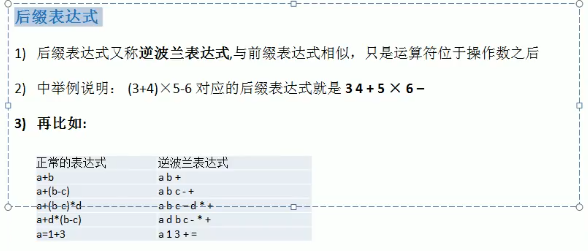
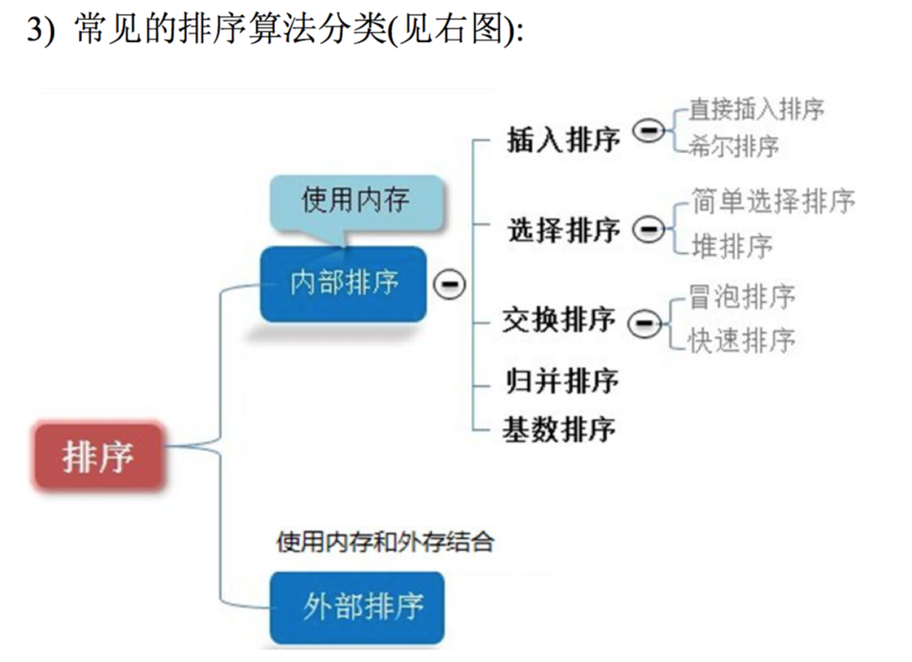
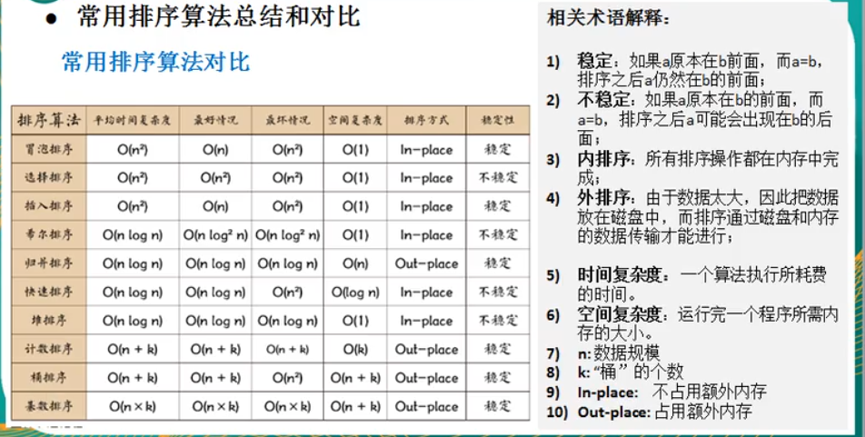
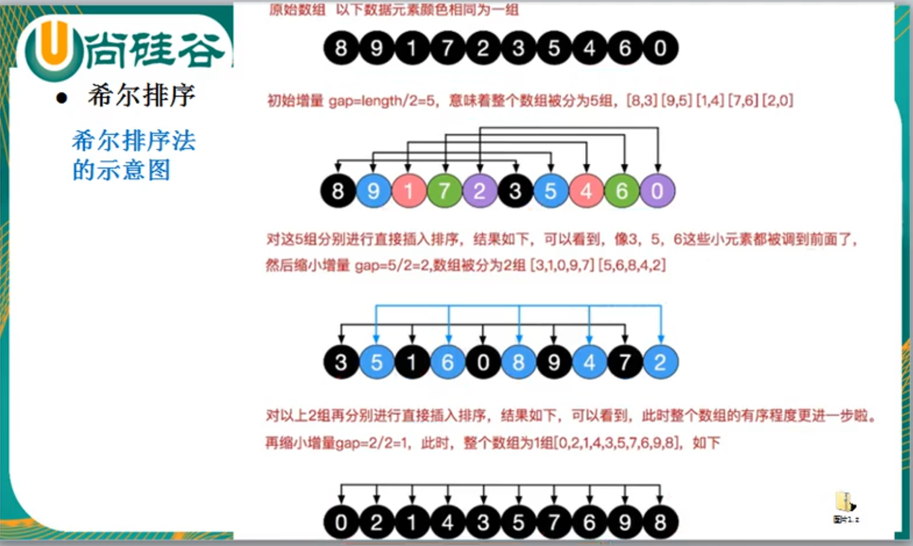

线性结构：顺序存储、链式存储   数组、队列、链表、栈

非线程结构：二维数组、多维数组、广义表、树、图


**稀疏数组**

```
当一个数组中大部分元素为0或者未同一个值的数组时，可以使用稀疏数组来保存该数组

处理方法：
1.记录数组一共有几行几列，有多少个不同的值
2.把具有不同值的元素的行列及值记录在一个小规模的数组中，从而缩小程序规模
3.行不确定，列有3列
```


**队列**  

```
有序列表，可以用数组或链表来实现

先进先出

```


**链表**


链式存储，不连续

内存中的实际结构


 

单向链表只能是一个方向查找，而双向链表可以向前向后查找。

单向链表不能自我删除，需要依靠辅助接点，而双向链表可以自己我删除


**双向链表**


**单向环形链表**

Josephus问题


**栈**

```
先入后出，元素的插入和删除只能在线性表的同一端

变化的一端： 栈顶 Top

固定的一端：栈底 Bottom 

Pop push

应用场景：对表达式的转化和求值、子程序调用、二叉树遍历、图的深度优先搜索

前缀表达式(波兰表达式)   运算符在操作数之前 -*+123
	从右到左扫描表达式，遇到数字时，将数字压入堆栈，遇到运算符时，如果当前的操作符的优先级小于等于栈中符号的优先级，就需要从数栈中 pop  两个数，弹出栈顶的两个数，用运算符对它们做相应的计算(栈顶元素和次栈顶元素)，并将结果入栈，否则运算符直接入栈，重复上述过程直到表达式最左端，最后运算得出的值即为表达式的结果

中缀表达式 (3+2)*6
	往往会将中缀表达式转化为其他表达式，经常转化为后缀表达式
后缀表达式(逆波兰表达式)
	与前缀表达式类似，只是运算符位于操作数之后  
	从左至右扫描表达式，遇到数字，将数字压入堆栈，遇到运算符，弹出栈顶的两个数，用运算符对它们做相应的计算(次栈顶元素和栈顶元素)，并将结果入栈。重复上述过程直到表达式最右端，最后运算得出的值即为表达式的结果。
```



```
中缀表达式转后缀表达式
1) 初始化两个栈，运算符栈 S1 存储中间结果栈 S2
2)从左至右扫描中缀表达式
3)当遇到操作数，将其压入 S2 栈
4)如果遇到运算符，比较其与 S1 栈顶的优先级
1.如果S1为空，或栈顶运算符为"(",则直接将此运算符入栈
2.否则，若优先级比栈顶运算符高，也将其压入 S1 栈
3.否则，将 S1 栈顶的运算符弹出并压入到 S2 中，再次转到 4.1 与 S1 中新的栈顶运算符相比较
5）遇到括号时：
1.如果是左括号"(",则直接压入 S1
2.如果是右括号")“，则依次弹出 S1 栈顶的运算符，并压入 S2,直到遇到左括号为止，此时将这一对括号丢弃
6)重复步骤2至5，直到表达式的最右边
7)将S1中剩余的运算符依次弹出并压入 S2
8)依次弹出S2中元素并输出，结果的逆序即为中缀表达式对应的后缀表达式

```


排序：



内部排序：将需要处理的**所有数据都加载到内存**中进行排序

外部排序：**数据量比较大**，无法全部加载到内存中，需要**借助外部存储(**文件等)进行排序


**时间复杂度：**

常数阶O(1)

对数阶O(logn)

线性阶O(n)

线性对数阶O(nlogn)

平方阶O(n^2)

立方阶O(n^3)

 K方阶O(n^k)

指数阶O(2^n)


随着n变大，忽略常数项、忽略低次项、忽略系数


**平均复杂度和最坏复杂度**

一般在说时间复杂度的时候考虑最坏的时间复杂度




**算法的空间复杂度**


**主要讨论时间复杂度**


像取数操作、交换操作、加减乘除都是常数级别的操作

评价一个算法流程的好坏，先看时间复杂度的指标，然后再分析不同数据样本下的实际运行时间，也就是常数项时间


选择排序：


**插入排序:**

把 n 个待排序的元素看成为一个有序表和一个无序表，开始时有序表中只包含一个元素，无序表中包含有 n-1 个元素，排序过程中每次从无序表中取出第一个元素，把它的排序码依次与有序元素的排序码进行比较，将它插入到有序表中的适当位置，使之成为新的有序表

当需要插入的数较少时，后移的次数明显增多，对效率有影响


**希尔排序**是更高版本的插入排序

希尔排序是把记录按下标的一定增量分组，对每组使用直接插入排序算法排序。随着增量逐渐减少，每组包含的元素越来越多，当增量减至 1 时，整个文件恰被分成一组，算法便终止。



  

位移法：就是步长会变的插入排序