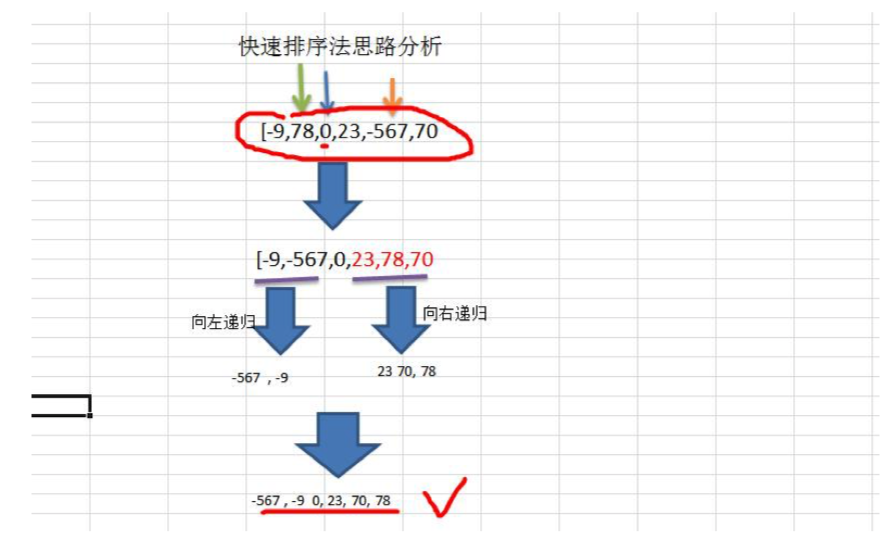
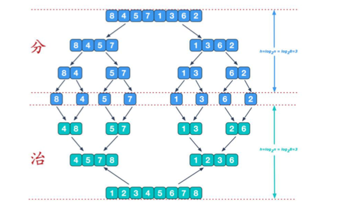
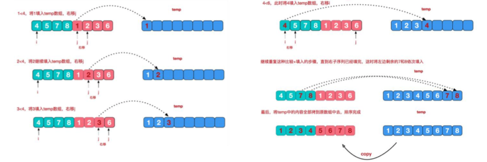
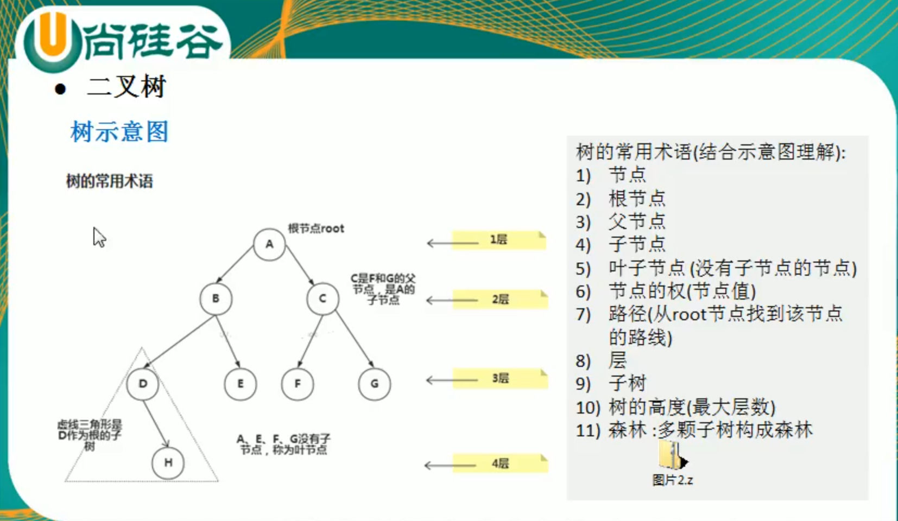
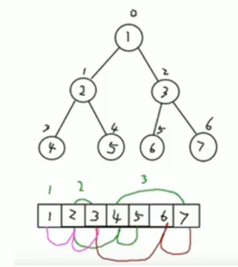

### 总括：

线性结构：顺序存储、链式存储   数组、队列、链表、栈

非线程结构：二维数组、多维数组、广义表、树、图


##### **稀疏数组**

```
当一个数组中大部分元素为0或者未同一个值的数组时，可以使用稀疏数组来保存该数组

处理方法：
1.记录数组一共有几行几列，有多少个不同的值
2.把具有不同值的元素的行列及值记录在一个小规模的数组中，从而缩小程序规模
3.行不确定，列有3列
```


##### **队列**  

```
有序列表，可以用数组或链表来实现

先进先出

```


##### **链表**


链式存储，不连续

内存中的实际结构


 

单向链表只能是一个方向查找，而双向链表可以向前向后查找。

单向链表不能自我删除，需要依靠辅助接点，而双向链表可以自己我删除


###### **双向链表**


###### **单向环形链表**

Josephus问题


##### **栈**

```
先入后出，元素的插入和删除只能在线性表的同一端

变化的一端： 栈顶 Top

固定的一端：栈底 Bottom 

Pop push

应用场景：对表达式的转化和求值、子程序调用、二叉树遍历、图的深度优先搜索

前缀表达式(波兰表达式)   运算符在操作数之前 -*+123
	从右到左扫描表达式，遇到数字时，将数字压入堆栈，遇到运算符时，如果当前的操作符的优先级小于等于栈中符号的优先级，就需要从数栈中 pop  两个数，弹出栈顶的两个数，用运算符对它们做相应的计算(栈顶元素和次栈顶元素)，并将结果入栈，否则运算符直接入栈，重复上述过程直到表达式最左端，最后运算得出的值即为表达式的结果

中缀表达式 (3+2)*6
	往往会将中缀表达式转化为其他表达式，经常转化为后缀表达式
后缀表达式(逆波兰表达式)
	与前缀表达式类似，只是运算符位于操作数之后  
	从左至右扫描表达式，遇到数字，将数字压入堆栈，遇到运算符，弹出栈顶的两个数，用运算符对它们做相应的计算(次栈顶元素和栈顶元素)，并将结果入栈。重复上述过程直到表达式最右端，最后运算得出的值即为表达式的结果。
```


```
中缀表达式转后缀表达式
1) 初始化两个栈，运算符栈 S1 存储中间结果栈 S2
2)从左至右扫描中缀表达式
3)当遇到操作数，将其压入 S2 栈
4)如果遇到运算符，比较其与 S1 栈顶的优先级
1.如果S1为空，或栈顶运算符为"(",则直接将此运算符入栈
2.否则，若优先级比栈顶运算符高，也将其压入 S1 栈
3.否则，将 S1 栈顶的运算符弹出并压入到 S2 中，再次转到 4.1 与 S1 中新的栈顶运算符相比较
5）遇到括号时：
1.如果是左括号"(",则直接压入 S1
2.如果是右括号")“，则依次弹出 S1 栈顶的运算符，并压入 S2,直到遇到左括号为止，此时将这一对括号丢弃
6)重复步骤2至5，直到表达式的最右边
7)将S1中剩余的运算符依次弹出并压入 S2
8)依次弹出S2中元素并输出，结果的逆序即为中缀表达式对应的后缀表达式

```


### 排序：


内部排序：将需要处理的**所有数据都加载到内存**中进行排序

外部排序：**数据量比较大**，无法全部加载到内存中，需要**借助外部存储(**文件等)进行排序


##### **时间复杂度：**

常数阶O(1)

对数阶O(logn)

线性阶O(n)

线性对数阶O(nlogn)

平方阶O(n^2)

立方阶O(n^3)

 K方阶O(n^k)

指数阶O(2^n)


随着n变大，忽略常数项、忽略低次项、忽略系数


##### **平均复杂度和最坏复杂度**

一般在说时间复杂度的时候考虑最坏的时间复杂度


##### **算法的空间复杂度**


**主要讨论时间复杂度**


像取数操作、交换操作、加减乘除都是常数级别的操作

评价一个算法流程的好坏，先看时间复杂度的指标，然后再分析不同数据样本下的实际运行时间，也就是常数项时间


##### **选择排序：**

第一次从 arr[0] ~ arr[n-1]中选取最小值，与arr[0]交换，第二次从 arr[1] ~ arrr[n-1]中选取最小值，与 arr[1]交换......第 n-1次从arr[n-2]~arr[n-1]中选取最小值与 arr[n-2]交换


##### **插入排序:**

把 n 个待排序的元素看成为一个有序表和一个无序表，开始时有序表中只包含一个元素，无序表中包含有 n-1 个元素，排序过程中每次从无序表中取出第一个元素，把它的排序码依次与有序元素的排序码进行比较，将它插入到有序表中的适当位置，使之成为新的有序表

当需要插入的数较少时，后移的次数明显增多，对效率有影响

插入排序可以理解为步长为 1 的希尔排序


##### **希尔排序**

是更高版本的插入排序

希尔排序是把记录按下标的一定增量分组，对每组使用直接插入排序算法排序。随着增量逐渐减少，每组包含的元素越来越多，当增量减至 1 时，整个文件恰被分成一组，算法便终止。


  

位移法：就是步长会变的插入排序


##### **快速排序：**

快速排序是对冒泡排序的一种改进。

通过一趟排序将要排序的数据分割成独立的两部分，其中一部分的所有数据都比另外一部分的所有数据都要小，然后再按照此方法对这两部分数据分别进行快速排序，整个排序的过程可以递归进行。




##### **归并排序**





##### **基数排序**

通过键值的各个位的值，将要排序的元素分配到某些 "桶" 中，达到排序的作用

 桶排序的扩展

 


### 查找算法：

1.顺序查找

2.二分查找

3.插值查找

4.斐波那契查找


### 哈希表

数组加链表

数组加二叉树


### 树

##### 数组存储：

数据固定大小的，需要扩容

按一定顺序添加元素慢需要整体后移，在后面插快

删除也需要整体移动

查找快，可以按索引查找


##### 链式存储：

容量原则上是无限的

插入快，不需要整体移动

删除快，不需要整体移动

查找慢，只能从头到尾遍历


##### 树存储：

**提高数据的存储和读取效率。**

比如利用二叉排序树，既可以保证数据检索速度同时也可以保证数据插入、删除、修改的速度





**二叉树**

每个节点最多只两个子节点

**满二叉树**

所有的叶子节点都在最后一层，并且节点总数 2^n-1 n 为层数

**完全二叉树**

所有的叶子节点都在最后一层或者倒数第二层，而且最后一层的叶子节点在左边连续，倒数第二层的叶子节点在右边连续


##### 二叉树遍历

前序：**先输出父节点**，再遍历左子树和右子树

中序：先遍历左子树，**再输出父节点**，再遍历右子树

后序：先遍历左子树，再遍历右子树，**最后输出父节点**

先左再右 


#####顺序存储二叉树

从数据存储来看，数组存储方式和树的存储方式可以相互转换，即数组可以转换为树，树也可以转换为数组

1. 顺序存储二叉通常只考虑完全二叉树

2. 第 n 个元素的左子节点为 2 *n+1

3. 第 n 个元素的右子节点为 2 * n +2

4. 第 n 个元素的父节点为 (n-1)/2

   n 表示二叉树中第几个元素




##### 树结构的实际应用

###### 堆排序

选择排序，最坏最好瓶颈时间复杂度均为 O(nlogn)，不稳定排序

堆是完全二叉树

**大顶堆**  每个节点的值都大于或等于其左右孩子节点的值

**小顶堆** 每个节点的值都小于或等于其左右孩子节点的值

**一般升序采用大顶堆，降序采用小顶堆**

##### 赫夫曼树 带权路径最短

给定 n 个权值作为 n 个**叶子节点**，构造一个二叉树，若该树的带权路径长度(wpl) 达到最小，称这样的树为 **最优二叉树**，也称 赫夫曼树

赫夫曼树是带权路径长度最短的树，权值较大的结点离根很近。

**路径长度**：从根节点到第 L 层节点的路径长度为 L -1 

**带权路径长度**：从根节点到该节点之间的路径长度与该节点的权的乘积

**树的带权路径长度**：树的带权路径长度规定为所有的叶子节点的带权路径长度之和。记为 WPL，权值越大的节点离根节点越近的二叉树才是最优二叉树

###### 构建赫夫曼树

1. 从小到大进行排序，每个数据都是一个节点，每个节点都可以看成一颗最简单的二叉树
2. 取出根节点权值最小的两颗二叉树
3. 组成一颗新的二叉树，该新的二叉树的根节点的权值是前面两颗二叉树根节点权值的和
4. 再将这颗新的二叉树，以根节点的权值大小再次排序。不断重复1-2-3-4步骤，直到数列中所有的数据都被处理，就得到了一颗赫夫曼树


前缀编码：字符的编码都不能是其他字符编码的前缀


##### 二叉排序树( BST )  插入快，查找快 ( 二叉搜索树 )

 BST 对于任何一个非叶子节点，要求左子节点的值比当前节点的值小，右子节点比当前节点的值大。

如果有相同的值，则可以放置到任意子节点位置

  

##### 平衡二叉树 ( AVL 树) 对平衡二叉树的一种优化  ( 左子树或者右子树不平衡 ）

对二叉排序树的一种优化，**前提是二叉排序树**

**平衡二叉搜索树，保证查询效率较高**

**它是一颗空树或者它的左右两颗树高度差的绝对值不超过1，并且左右两个子树都是一个平衡二叉树。**

平衡二叉树常用的实现方法有红黑树、avl、替罪羊树、伸展树等( 算法 )


 