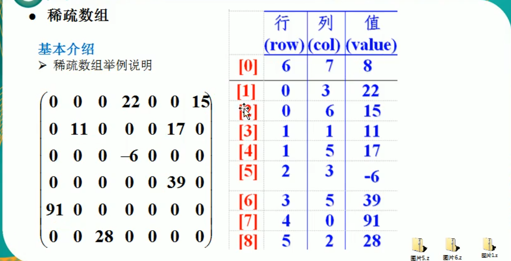
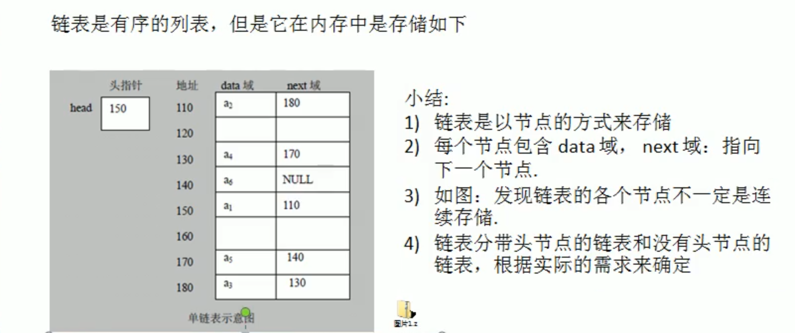

线性结构：顺序存储、链式存储   数组、队列、链表、栈

非线程结构：二维数组、多维数组、广义表、树、图


**稀疏数组**

```
当一个数组中大部分元素为0或者未同一个值的数组时，可以使用稀疏数组来保存该数组

处理方法：
1.记录数组一共有几行几列，有多少个不同的值
2.把具有不同值的元素的行列及值记录在一个小规模的数组中，从而缩小程序规模
3.行不确定，列有3列
```




**队列**  

有序列表，可以用数组或链表来实现

先进先出


**链表**

链式存储，不连续

内存中的实际结构



 